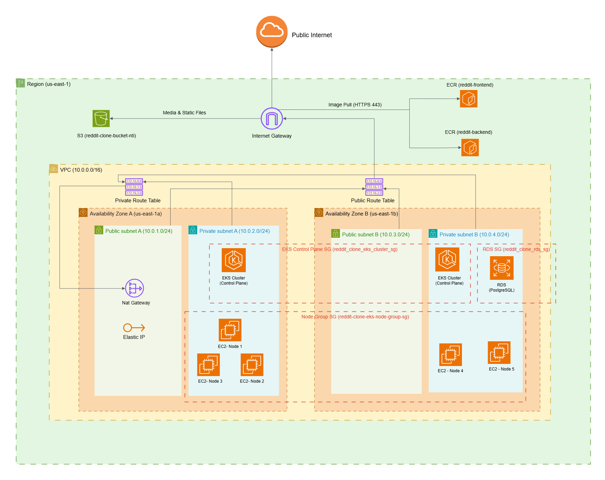

# Reddit Clone — AWS Infrastructure

<p align="center">
  
</p>

Terraform-managed, production-grade AWS infrastructure for deploying a full-stack Reddit Clone application. The entire lifecycle — from provisioning to teardown — is automated through a GitHub Actions workflow operating across a dual-account architecture.

---

## Table of Contents

- [Architecture Overview](#architecture-overview)
- [Infrastructure Components](#infrastructure-components)
  - [Networking — VPC Module](#networking--vpc-module)
  - [Compute — EKS Module](#compute--eks-module)
  - [Database — RDS Module](#database--rds-module)
  - [Object Storage — S3 Module](#object-storage--s3-module)
  - [Container Registry — ECR Module](#container-registry--ecr-module)
- [Network Architecture](#network-architecture)
  - [Subnet Design](#subnet-design)
  - [Routing](#routing)
  - [NAT Gateway](#nat-gateway)
- [Security Architecture](#security-architecture)
  - [Security Groups](#security-groups)
  - [Security Group Rules Matrix](#security-group-rules-matrix)
  - [IAM Roles & Policies](#iam-roles--policies)
  - [Encryption & Access Control](#encryption--access-control)
- [State Management](#state-management)
- [Deployment](#deployment)
  - [Via GitHub Actions (Recommended)](#via-github-actions-recommended)
  - [Via CLI](#via-cli)
- [Configuration Reference](#configuration-reference)
  - [Input Variables](#input-variables)
  - [Terraform Outputs](#terraform-outputs)
- [Required GitHub Secrets](#required-github-secrets)
- [Project Structure](#project-structure)
- [Technology Stack](#technology-stack)

---

## Architecture Overview

| Property | Value |
|---|---|
| **AWS Region** | `us-east-1` |
| **Availability Zones** | 2 — `us-east-1a`, `us-east-1b` |
| **Infrastructure as Code** | Terraform ≥ 1.0 with AWS Provider ~> 5.0 |
| **CI/CD** | GitHub Actions — manual workflow dispatch |
| **State Backend** | S3 + DynamoDB on a dedicated, separate AWS account |
| **Environment** | Development |
| **Project Tag** | `RedditClone` |

The infrastructure follows a **dual-account** model:

- **State Account** — Hosts the Terraform remote state (S3 bucket + DynamoDB lock table). Credentials are used only during `terraform init`.
- **Target Account** — Where all application infrastructure (VPC, EKS, RDS, S3, ECR) is provisioned. Credentials are injected at plan/apply/destroy time.

---

## Infrastructure Components

### Networking — VPC Module

A custom Virtual Private Cloud spanning two Availability Zones with full public/private subnet isolation.

| Resource | Name | Details |
|---|---|---|
| **VPC** | `reddit-clone-vpc` | CIDR `10.0.0.0/16` — 65,536 addresses |
| **Public Subnet A** | `reddit-clone-public-subnet-a` | `10.0.1.0/24` · `us-east-1a` · Auto-assign public IP |
| **Public Subnet B** | `reddit-clone-public-subnet-b` | `10.0.3.0/24` · `us-east-1b` · Auto-assign public IP |
| **Private Subnet A** | `reddit-clone-private-subnet-a` | `10.0.2.0/24` · `us-east-1a` · No public IP |
| **Private Subnet B** | `reddit-clone-private-subnet-b` | `10.0.4.0/24` · `us-east-1b` · No public IP |
| **Internet Gateway** | `reddit-clone-igw` | Provides internet access to public subnets |
| **NAT Gateway** | `reddit-clone-nat-gw` | Deployed in Public Subnet A with an Elastic IP |
| **Elastic IP** | `reddit-clone-nat-eip` | Static IP allocated for the NAT Gateway |
| **Public Route Table** | `reddit-clone-public-rt` | `0.0.0.0/0` → Internet Gateway |
| **Private Route Table** | `reddit-clone-private-rt` | `0.0.0.0/0` → NAT Gateway |

### Compute — EKS Module

Amazon Elastic Kubernetes Service cluster with a managed node group deployed entirely in private subnets.

| Resource | Name | Details |
|---|---|---|
| **EKS Cluster** | `reddit-clone-eks-cluster` | Kubernetes `1.33` |
| **API Server Endpoint** | — | Both public and private access enabled |
| **Cluster Subnets** | — | Private subnets only (`us-east-1a` + `us-east-1b`) |
| **Node Group** | `reddit-clone-eks-cluster-node-group` | Managed by EKS |
| **Instance Type** | — | `t3.medium` (2 vCPUs, 4 GiB RAM) |
| **Scaling Configuration** | — | Min: **3** · Max: **5** · Desired: **5** |
| **Node Subnets** | — | Private subnets across both AZs |
| **Cluster IAM Role** | `reddit-clone-eks-cluster-cluster-role` | `AmazonEKSClusterPolicy`, `AmazonEKSServicePolicy` |
| **Node IAM Role** | `reddit-clone-eks-cluster-node-role` | `AmazonEKSWorkerNodePolicy`, `AmazonEKS_CNI_Policy`, `AmazonEC2ContainerRegistryReadOnly` |

### Database — RDS Module

Amazon RDS PostgreSQL instance deployed in private subnets, accessible only from within the EKS cluster.

| Resource | Name | Details |
|---|---|---|
| **RDS Instance** | `reddit-clone-db` | PostgreSQL `17.6` |
| **Instance Class** | — | `db.t3.micro` |
| **Database Name** | — | `redditclone` |
| **Master Username** | — | `redditadmin` |
| **Port** | — | `5432` |
| **Storage** | — | 20 GB initial · Auto-scales up to 100 GB |
| **Multi-AZ** | — | Disabled (single-AZ deployment) |
| **Publicly Accessible** | — | **No** — private subnets only |
| **Backup Retention** | — | 0 days (development environment) |
| **Deletion Protection** | — | Disabled |
| **Final Snapshot** | — | Skipped on deletion |
| **Subnet Group** | `reddit-clone-rds-subnet-group` | Private Subnet A + Private Subnet B |
| **Security Group** | `reddit-clone-rds-sg` | Accepts connections only from EKS security groups |

### Object Storage — S3 Module

Amazon S3 bucket for serving static assets and user-uploaded media content.

| Resource | Details |
|---|---|
| **Bucket Name** | `reddit-clone-bucket-nti` |
| **Versioning** | Enabled |
| **Server-Side Encryption** | AES-256 (SSE-S3) |
| **Ownership Controls** | `BucketOwnerEnforced` |
| **Public ACLs** | Blocked (`block_public_acls = true`, `ignore_public_acls = true`) |
| **Public Bucket Policy** | Allowed (`block_public_policy = false`, `restrict_public_buckets = false`) |
| **Bucket Policy** | Public read (`s3:GetObject`) on `static/*` and `media/*` prefixes only |

### Container Registry — ECR Module

Private Elastic Container Registry repositories for application Docker images.

| Resource | Details |
|---|---|
| **Repositories** | `reddit-backend`, `reddit-frontend` |
| **Image Tag Mutability** | Mutable (allows tag overwrite for development flexibility) |
| **Image Scanning** | Enabled on push — automatic vulnerability scanning |

---

## Network Architecture

### Subnet Design

The VPC is split across **two Availability Zones** for high availability, with each AZ containing one public and one private subnet:

```
                        VPC: 10.0.0.0/16
    ┌──────────────────────────┬──────────────────────────┐
    │       AZ: us-east-1a     │       AZ: us-east-1b     │
    ├──────────────────────────┼──────────────────────────┤
    │  Public:  10.0.1.0/24    │  Public:  10.0.3.0/24    │
    │  Private: 10.0.2.0/24    │  Private: 10.0.4.0/24    │
    └──────────────────────────┴──────────────────────────┘
```

### Routing

| Route Table | Destination | Target | Associated Subnets |
|---|---|---|---|
| `reddit-clone-public-rt` | `0.0.0.0/0` | Internet Gateway | Public Subnet A, Public Subnet B |
| `reddit-clone-private-rt` | `0.0.0.0/0` | NAT Gateway | Private Subnet A, Private Subnet B |

### NAT Gateway

A single NAT Gateway is deployed in **Public Subnet A** (`10.0.1.0/24` in `us-east-1a`). It provides outbound internet access for all resources in both private subnets (EKS nodes pulling container images, OS updates, external API calls). An Elastic IP is attached to ensure a stable public address for outbound traffic.

```
Private Subnet A/B  →  NAT Gateway (Public Subnet A)  →  Internet Gateway  →  Internet
```

---

## Security Architecture

### Security Groups

Four security groups govern network-level access control within the VPC:

| Security Group | Attached To | Purpose |
|---|---|---|
| **Cluster SG** (`reddit-clone-eks-cluster-cluster-sg`) | EKS Control Plane | Controls traffic to/from the Kubernetes API server |
| **Node Group SG** (`reddit-clone-eks-cluster-node-group-sg`) | EKS Worker Nodes | Controls traffic to/from the EC2 instances running pods |
| **RDS SG** (`reddit-clone-rds-sg`) | RDS PostgreSQL Instance | Restricts database access to EKS workloads only |
| **EKS Managed SG** | Auto-created by EKS | AWS-managed communication between control plane and nodes |

### Security Group Rules Matrix

**Cluster SG — Inbound:**

| Port / Protocol | Source | Description |
|---|---|---|
| `443 / TCP` | Node Group SG | Nodes → Kubernetes API server |
| `30000–32767 / TCP` | `0.0.0.0/0` | External traffic → NodePort services |

**Cluster SG — Outbound:** All traffic to `0.0.0.0/0`

---

**Node Group SG — Inbound:**

| Port / Protocol | Source | Description |
|---|---|---|
| `All traffic` | Self (Node Group SG) | Node-to-node communication (pod networking, CoreDNS, etc.) |
| `1025–65535 / TCP` | Cluster SG | Control plane → nodes (kubelet, webhooks, logs) |

**Node Group SG — Outbound:** All traffic to `0.0.0.0/0`

---

**RDS SG — Inbound:**

| Port / Protocol | Source | Description |
|---|---|---|
| `5432 / TCP` | Node Group SG | Worker nodes → PostgreSQL |
| `5432 / TCP` | Cluster SG | Cluster control plane → PostgreSQL |
| `5432 / TCP` | EKS Managed SG | EKS-managed components → PostgreSQL |

**RDS SG — Outbound:** All traffic to `0.0.0.0/0`

### IAM Roles & Policies

**EKS Cluster Role** (`reddit-clone-eks-cluster-cluster-role`):

| Policy | Purpose |
|---|---|
| `AmazonEKSClusterPolicy` | Allows EKS to manage cluster resources |
| `AmazonEKSServicePolicy` | Allows EKS to create and manage AWS resources for the cluster |

**EKS Node Role** (`reddit-clone-eks-cluster-node-role`):

| Policy | Purpose |
|---|---|
| `AmazonEKSWorkerNodePolicy` | Allows worker nodes to connect to EKS |
| `AmazonEKS_CNI_Policy` | Allows the VPC CNI plugin to manage ENIs and IP addresses |
| `AmazonEC2ContainerRegistryReadOnly` | Allows nodes to pull container images from ECR |

### Encryption & Access Control

| Resource | Encryption | Access Model |
|---|---|---|
| **Terraform State** | S3 SSE (encrypted at rest) | State account credentials only |
| **S3 Media Bucket** | AES-256 (SSE-S3) | Public read on `static/*` and `media/*`; all else private |
| **RDS PostgreSQL** | Default AWS encryption | Security group restricted — EKS SGs only |
| **ECR Repositories** | AWS default encryption | `AmazonEC2ContainerRegistryReadOnly` via node IAM role |

---

## State Management

Terraform state is stored remotely in a **dedicated AWS account**, separate from the infrastructure target account.

| Component | Name | Details |
|---|---|---|
| **S3 Bucket** | `reddit-nti-tfstate` | Stores `terraform.tfstate` with server-side encryption enabled |
| **DynamoDB Table** | `reddit-nti-tfstate-lock` | Provides state locking to prevent concurrent modifications |
| **Region** | `us-east-1` | Same region as the target infrastructure |
| **State Key** | `terraform.tfstate` | Single state file for the entire infrastructure |

This separation ensures that:
- Infrastructure credentials cannot access or corrupt the state file
- State account credentials have no ability to provision resources
- Each account follows the **principle of least privilege**

---

## Deployment

### Via GitHub Actions (Recommended)

1. Navigate to **Actions** → **Infrastructure Provisioning Workflow**
2. Click **Run workflow**
3. Select the desired action from the dropdown
4. Click **Run workflow** to execute

| Action | Terraform Command | Description |
|---|---|---|
| `plan` | `terraform plan` | Preview what will be created, changed, or destroyed |
| `apply` | `terraform apply -auto-approve` | Provision or update all infrastructure resources |
| `outputs` | `terraform output` | Display current values of all Terraform outputs |
| `destroy` | `terraform destroy -auto-approve` | Tear down all resources managed by Terraform |

> **Best Practice:** Always run `plan` before `apply` to review changes.

See [`.github/workflows/README.md`](.github/workflows/README.md) for complete pipeline documentation.

### Via CLI

```bash
cd infra

# Initialize backend (requires State Account credentials in environment)
terraform init

# Preview changes
terraform plan -input=false \
  -var="target_access_key=<TARGET_ACCESS_KEY>" \
  -var="target_secret_key=<TARGET_SECRET_KEY>"

# Apply changes
terraform apply -input=false -auto-approve \
  -var="target_access_key=<TARGET_ACCESS_KEY>" \
  -var="target_secret_key=<TARGET_SECRET_KEY>"

# View outputs
terraform output

# Destroy infrastructure
terraform destroy -auto-approve \
  -var="target_access_key=<TARGET_ACCESS_KEY>" \
  -var="target_secret_key=<TARGET_SECRET_KEY>"
```

---

## Configuration Reference

### Input Variables

| Variable | Type | Default | Description |
|---|---|---|---|
| `target_access_key` | `string` (sensitive) | — | AWS access key for the target account |
| `target_secret_key` | `string` (sensitive) | — | AWS secret key for the target account |
| `vpc_cidr_block` | `string` | `10.0.0.0/16` | VPC CIDR address space |
| `public_subnet_cidr_block_a` | `string` | `10.0.1.0/24` | Public subnet A CIDR |
| `public_subnet_cidr_block_b` | `string` | `10.0.3.0/24` | Public subnet B CIDR |
| `private_subnet_cidr_block_a` | `string` | `10.0.2.0/24` | Private subnet A CIDR |
| `private_subnet_cidr_block_b` | `string` | `10.0.4.0/24` | Private subnet B CIDR |
| `cluster_name` | `string` | `reddit-clone-eks-cluster` | EKS cluster name |
| `eks_version` | `string` | `1.33` | Kubernetes version |
| `node_instance_type` | `string` | `t3.medium` | EC2 instance type for worker nodes |
| `node_min_size` | `number` | `3` | Minimum nodes in the auto-scaling group |
| `node_max_size` | `number` | `5` | Maximum nodes in the auto-scaling group |
| `db_name` | `string` | `reddit-clone-db` | RDS instance identifier |
| `db_database_name` | `string` | `redditclone` | PostgreSQL database name |
| `db_username` | `string` | `redditadmin` | Database master username |
| `db_password` | `string` (sensitive) | — | Database master password |
| `db_instance_class` | `string` | `db.t3.micro` | RDS instance class |
| `db_engine` | `string` | `postgres` | Database engine |
| `db_engine_version` | `string` | `17.6` | PostgreSQL engine version |
| `s3_bucket_name` | `string` | `reddit-clone-bucket-nti` | S3 bucket name for media/static files |
| `ecr_names` | `list(string)` | `["reddit-backend", "reddit-frontend"]` | ECR repository names |
| `tags` | `map(string)` | `{Environment = "Dev", Project = "RedditClone"}` | Resource tags |

### Terraform Outputs

| Output | Description |
|---|---|
| `vpc_id` | VPC ID |
| `public_subnet_ids` | List of public subnet IDs |
| `private_subnet_ids` | List of private subnet IDs |
| `internet_gateway_id` | Internet Gateway ID |
| `nat_eip_id` | Elastic IP ID for the NAT Gateway |
| `nat_gateway_id` | NAT Gateway ID |
| `public_route_table_id` | Public route table ID |
| `private_route_table_id` | Private route table ID |
| `eks_cluster_name` | EKS cluster name |
| `eks_cluster_endpoint` | Kubernetes API server endpoint |
| `eks_cluster_arn` | EKS cluster ARN |
| `eks_node_group_name` | Node group name |
| `eks_node_group_arn` | Node group ARN |
| `eks_cluster_sg_id` | Cluster security group ID |
| `eks_node_group_sg_id` | Node group security group ID |
| `eks_cluster_managed_sg_id` | EKS auto-created managed security group ID |
| `ecr_repository_urls` | Map of ECR repository names to URLs |
| `ecr_registry_url` | ECR registry URL (without repository name) |
| `s3_bucket_name` | S3 bucket name |
| `db_endpoint` | RDS connection endpoint (host:port) |
| `db_port` | RDS port number |
| `db_instance_id` | RDS instance ID |

---

## Required GitHub Secrets

Configure these in **Repository Settings → Secrets and variables → Actions**:

| Secret | AWS Account | Purpose |
|---|---|---|
| `STATE_AWS_ACCESS_KEY_ID` | State Account | Access key for S3 backend and DynamoDB lock table |
| `STATE_AWS_SECRET_ACCESS_KEY` | State Account | Secret key for S3 backend and DynamoDB lock table |
| `TARGET_AWS_ACCESS_KEY_ID` | Target Account | Access key for provisioning infrastructure resources |
| `TARGET_AWS_SECRET_ACCESS_KEY` | Target Account | Secret key for provisioning infrastructure resources |

---

## Project Structure

```
nti-final-project-infra/
├── README.md                            # Full infrastructure documentation
├── .github/
│   └── workflows/
│       ├── infra.yml                    # GitHub Actions workflow definition
│       └── README.md                    # Pipeline documentation
├── docs/
│   └── infra_diagram.png               # Architecture diagram
└── infra/
    ├── main.tf                          # Root module — orchestrates all child modules
    ├── variables.tf                     # Input variable declarations
    ├── terraform.tfvars                 # Variable values for the environment
    ├── outputs.tf                       # Exported resource attributes
    ├── provider.tf                      # AWS provider configuration (us-east-1)
    ├── backend.tf                       # S3 remote state backend configuration
    ├── versions.tf                      # Terraform and provider version constraints
    └── modules/
        ├── vpc/                         # VPC, subnets, IGW, NAT GW, route tables
        │   ├── main.tf
        │   ├── variables.tf
        │   └── outputs.tf
        ├── eks/                         # EKS cluster, node group, IAM roles, security groups
        │   ├── main.tf
        │   ├── variables.tf
        │   └── outputs.tf
        ├── rds/                         # RDS PostgreSQL, DB subnet group, security group
        │   ├── main.tf
        │   ├── variables.tf
        │   └── outputs.tf
        ├── s3/                          # S3 bucket, versioning, encryption, bucket policy
        │   ├── main.tf
        │   ├── variables.tf
        │   └── outputs.tf
        └── ecr/                         # ECR private repositories
            ├── main.tf
            ├── variables.tf
            └── outputs.tf
```

---

## Technology Stack

| Tool | Version | Purpose |
|---|---|---|
| **Terraform** | ≥ 1.0 (workflow uses 1.7.5) | Infrastructure as Code |
| **AWS Provider** | ~> 5.0 | Terraform AWS resource management |
| **GitHub Actions** | — | CI/CD pipeline for infrastructure provisioning |
| **Amazon VPC** | — | Network isolation and segmentation |
| **Amazon EKS** | Kubernetes 1.33 | Container orchestration |
| **Amazon RDS** | PostgreSQL 17.6 | Managed relational database |
| **Amazon S3** | — | Object storage for static and media files |
| **Amazon ECR** | — | Private container image registry |
| **Amazon DynamoDB** | — | Terraform state locking |